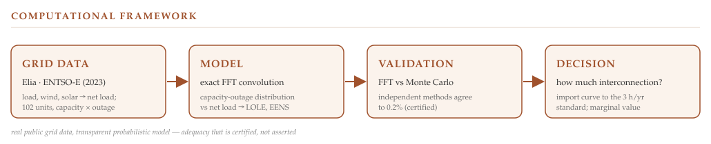
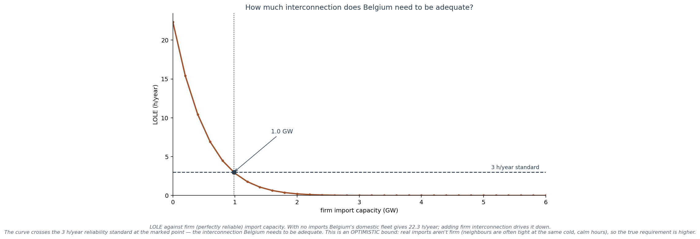

# Resource Adequacy



**Probabilistic electricity resource-adequacy assessment using exact FFT convolution on real grid data, independently validated against Monte Carlo, with engineering insights into interconnection value and marginal capacity contributions.**

---

## Overview

Will there be enough electricity when demand is highest? *Resource adequacy* asks whether available
generation can meet demand, and quantifies the shortfall risk as **LOLE** (loss-of-load expectation,
hours per year) and **EENS** (expected energy not served). This repository builds the full distribution
of the supply-minus-demand balance from real Belgian grid data and reads those metrics off it — exactly.

The method is a compound distribution: each of ~100 generating units is available at its capacity or out
(a forced outage), and the units are convolved by **FFT** into the exact distribution of available
capacity, then compared against the real net-load series. The headline assessments in the field
(ENTSO-E's ERAA, Elia's Adequacy & Flexibility study) rely on Monte Carlo; here the exact convolution is
the reference, and Monte Carlo becomes the independent check.

The accompanying technical note (`Resource_Adequacy_Note.pdf`) develops the methodology and results in
full.

---

## Contributions

- exact FFT computation of the capacity-outage distribution and of LOLE / EENS;
- an independent Monte-Carlo cross-check — surfacing, and resolving, a temporal-sampling discrepancy;
- the **interconnection curve**: how much firm import capacity Belgium needs to meet its standard;
- the **marginal adequacy value** of each technology, and a demand-vs-reliability sensitivity ranking;
- a reproducible pipeline from public Elia and ENTSO-E data.

---

## Headline results

On the Belgian system for 2023 (≈13.1 GW dispatchable fleet, real quarter-hourly net load):



- **The domestic fleet alone misses the standard — but only just.** With no imports, LOLE is **22.3
  h/year** against Belgium's **3 h/year** reliability standard. Yet only **~1 GW of firm interconnection
  closes that 19-hour gap** — the system sits on a knife's edge, not far below it. And the first
  gigawatt is worth far more than the next: the curve collapses, then flattens near zero by ~2.5 GW.
- **Demand is the adequacy threat, not the plant mix.** LOLE is about **9× more sensitive to peak
  demand than to plant reliability** (elasticity ≈ +22 vs +2.4). Adding 100 MW buys ~3.5 h/year almost
  regardless of technology; what matters is how *reliably present* it is — firm imports and low-outage
  hydro shave the winter tail hardest.
- **The risk is concentrated in a few winter evenings.** Of 35,037 quarter-hours, ~8,000 carry some
  risk, but the expected loss piles into a handful of cold, dark, low-renewable peaks — the tail is
  everything.

---

## Method

| Component | Approach |
|---|---|
| Supply | ~100 units, each two-state (available at capacity, or out at its forced-outage rate), **convolved by FFT** into the exact available-capacity distribution |
| Demand | real 2023 net load = measured load − wind − solar (Elia), used empirically — no distribution fitting |
| Metrics | LOLE (h/year) and EENS (MWh/year), swept over the real net-load series against the capacity CDF |
| Validation | independent Monte Carlo, agreeing to **0.2%** after reconciling the per-hour independence assumption |
| Extensions | interconnection curve (firm imports vs LOLE); marginal value & elasticities, each an exact re-convolution |
| Data | Elia Open Data (load, wind, solar, generating units; no token) and ENTSO-E (outages; free token) |

Because the aggregation is exact, the *differences* between scenarios (marginal value, sensitivities)
carry no sampling noise — which is where exact convolution earns its place over simulation.

---

## Scope

v1 is deliberately bounded, and each boundary is a named next step, not a hidden assumption:

- **No imports** in the baseline — so the 22.3 h/year figure is *domestic* adequacy, pessimistic by
  construction; the interconnection curve then quantifies exactly what imports are worth.
- **A single 2023 weather year** — adequacy lives in the extreme tail, so a proper study replays many
  climate years; read the result as "for a 2023-like year".
- **Forced-outage rates from planning tables**, by fuel type, not fitted to observed outages.

Each is a v2 hook: import availability/correlation, multiple weather years, and empirical FORs from
ENTSO-E outage data.

---

## Repository contents

| Path | Description |
|---|---|
| `resource_adequacy.ipynb` | Complete, reproducible implementation (acquisition + model + validation + results) |
| `Resource_Adequacy_Note.pdf` | Technical note: methodology, validation, results |
| `figures/` | Framework banner and result figures |

---

## Requirements & reproduction

Python 3.12 or later, with:

```
numpy · pandas · matplotlib · requests · entsoe-py
```

To reproduce:

1. Run the notebook top to bottom (Kernel → Restart & Run All). The **acquisition** half (§1) pulls
   load, wind, solar and the generating fleet from **Elia Open Data** (no token). Generation outages
   come from **ENTSO-E** (§1) and need a free token from `transparency.entsoe.eu` — that cell is guarded
   and skips cleanly if the token is absent.
2. The **model** half (§2–§4) runs offline and regenerates every figure, the validation, and the
   interconnection and marginal-value results.

*Real public grid data, transparent probabilistic model:* every input traces to Elia or ENTSO-E, and the
model is built by exact convolution rather than fitted, so the study is reproducible and every number is
explainable.

---

## Why this repository is different

Most adequacy studies compute a LOLE by Monte Carlo and trust one implementation. Here the result is
treated as something to be **certified, not asserted**: it is computed exactly by FFT convolution and
independently reproduced by Monte Carlo — a cross-check that caught a real temporal-sampling issue before
it reached the answer. The same discipline runs through the companion
[LongevityRisk](https://github.com/evrelegh/LongevityRisk) and
[ClinicalSupplyRisk](https://github.com/evrelegh/ClinicalSupplyRisk) studies — the aim is not to produce
a number, but to establish that the number is right, and then to ask what it lets you decide.

---

## Author

**Erik Van Releghem** · PHNX

A reproducible research implementation, intended for research and educational use rather than production
software.
